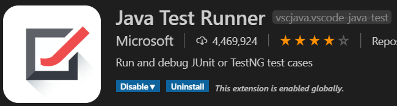

# Software Quality Assurance Handbook 

This assignment requires the development of a software component for storing information about Surveys and Responses. It does not have a user face or a connection to external storage.

- It should be written with the use of unit testing and with the approach of Test Driven Development.

- A test coverage metric will be selected and discussed.

- This assignment will follow the git flow process.

- Code will be reviewed with a code-review checklist. 

# Scrum

## Sprint Backlog

The *sprint backlog* is a list of tasks identified by the Scrum team, or in the case of this assignment myself,  to be completed during the Scrum sprint. During the sprint planning meeting, the number of product backlog items are selected and the tasks necessary to complete each item is identified. 
Estimates of how many hours each task will take will be given.

## Task Estimation
*Test Estimation* is a management activity which approximates how long a Task would take to complete.

To use benefit from task estimation I will begin by 
1. Breaking the project down into tasks
2. Estimate the effort required to complete each task

| Task    	| Estimates    | 
|----------	|--------	|
| Create a new survey     	| 1   	|
| Add a question to the survey   	| 1   	|
| Get a list of all surveys     	| 3   	|
|Get a specific survey by name       	| 3  	|
| Create a new survey response       	| 1  	|
| Add a question to survey response      	| 1   	| 
| Get all survey responses with specific survey     	| 5 |
| Get the average     	| 3    	|
| Get the standard deviation     	| 3  	| 
| Get the max score     	| 3 	| 
| Get the min score     	| 3 	| 
| Get standard deviation for specific question    	| 5  	| 
| Get average for specific question    	| 5   	| 
| Get max for specific question    	| 5     	|
| Get the min for specific questionc    	| 5   	|

## Task Estimates
I have estimated my tasks with story points 
**Story points** rate the relative effort of work in a Fibonacci-like format: 0, 0.5, 1, 2, 3, 5, 8, 13, 20, 40, 100
For my task estimation I used, 1,3,5, this will make it easier for me to identify a easy, medium or small task.

## Task Comparsion
To demonstrate how I decided the story points for each task I will explain via task comparsion.

1. Add a question to the survey
2. Get the average for a specific question on a survey

I rated *Add a question to the survey* as a story point 1; as it has a ligher work load

* It will require a test
* It will involve creating new objects

I rated *Get the average for a specific question on a survey* as a story point 5; as it involves more work

* It will require a test
* It will have a method that returns a value
* It will involve the use of sums
* It will involve going through a collection
* It will involve using information from another collection

## Velocity Metric 
*Velocity* is the average amount of work a scrum team completes during a sprint, it can be measured in story points or hours, and is very useful for forecasting.

**Caculating Velocity** to calculate the velocity I add up all the story points and divide them by the number of sprints

*Example* 
The actual velocity is 47, for example if there is 3 sprints it would result in 47/3 
Resulting in the velocity for each sprint would be 16

This would mean the story points would be divied into sections which total 16, for each sprint
 
This can be carried through out the project to stay on track and to manage a suitable work load.

# Testing 

## Test Driven Development 

This application will be coded using *Test-driven development (TDD)* this is a development technique where
you must first write a test that fails before you write new functional code.

I will use the *traffic light sequence* when developing code:
 1. Red
 2. Green 
 3. Refactor
 
 *1. Red*
 This is writing tests that you know will fail. A red flag will be given by the
 unit testing framework. 
 
 *2. Green*
 This is writing code only to make the test pass. It is a concept of coding just enough to
 make the test pass. 
 
 *3. Refactor*
 This is when you take your code further than just allowing it to pass. Adding 
 other aspects of code. Whether it means code quality or reusability. If functionality is 
 added the tests will excute again to confirm functionality.

 Below is an example of using test driven development and satisfying my code review checklist

 [Example of using TDD approach](https://github.com/gillianoconnorx/QACA/pull/9)

 # Metric

## Test Coverage Metric

**Test coverage** is defined as a metric in Software Testing 
that measures the amount of testing performed by a set of test.

 For the development of this assignment I will be using the test coverage metric 
 provided with Visual Studio Code.
 It is a light weight extension that allows users to run and debug Junit or TestNG test
 cases in Visual Studio Code. 

## Test Coverage Metric

**Test coverage** is defined as a metric in Software Testing 
that measures the amount of testing performed by a set of test.

 For the development of this assignment I will be using the test coverage metric 
 provided with Visual Studio Code.
 It is a light weight extension that allows users to run and debug Junit or TestNG test
 cases in Visual Studio Code. 

   
## Java Test Runner:

 Java Test Runner offers :

   * Run/Debug test cases
   * Customize test configurations
   * View test report
   * View tests in Test Explorer
   * Show test logs)

 Java Test Runner offers :

   * Run/Debug test cases
   * Customize test configurations
   * View test report
   * View tests in Test Explorer
   * Show test logs

# Version Control

## Team Version Control
*Version control* is important for all code, files, and assets that multiple 
team members will collaborate on. I will be using this version control for my project.
Using version control software helps you keep track of changes.
	
I decided to split up my code using different branches.
	
**Master Branch**

The master branch will be the branch containing the finshed project. I will use pull requests 
to merge the other branches.

**FinalDev**

This is where I will merge all my  feature branches before using pull requests to merge it to the 
master branch.
	
	
**Scrum**

This will contain all my documentation for my sprint backlog.
	
**TDD**

This will contain all my documentation for my Test Driven Development.
	
**Coverage**

This will contain all my documentation for my test coverage metric used.
	
**CheckList**

This will contain all my documentation for my Code Review CheckList.
	
**Dev**

This branch will contain the code for the survey. 

**Devres**

This branch will contain the code for the survey responses. 

**Devmath**

This branch will contain the code for the maths ie. the average, the min and max score. 

	
* All the branches will be merged to the finaldev branch and then added to the master branch. 
* When the devres branch was reviewed it was ready to be merged with the *finaldev*

1. A **pull request** was made to merge the devres branch to the finaldev branch
2. The **pull request** was reviewed and approved, the branch was then merged

[Pull Request](https://github.com/gillianoconnorx/QACA/pull/8)

## Code Review Checklist 

 **Code Review Checklist** helps the code reviewers and software developers 
 (during self code review) to gain expertise in the code review process, 
 as these points are easy to remember and follow during the code review process.
 
 
 ## My Code Review Checklist 
 * Commits to git are identifiable
 * Remove Duplicate code
	* obvious logicial errors removed from code 
 * Easily understandable code 
    * is my code formatting correct?
 * No errors due to using testing methods
 * No spelling or grammar errors 
 * All documentation is linked correctly 
 * Checking all requirements are implemented

 ## Pull Requests
 * I began merging my branches into my finaldev; this is to stop confusion and keep master branch clean and organised
 * My plan is to merge my files one by one to the finaldev branch
 * As I began this process I ran into merge conflicts that were fixed via the command line
 * I ran into an error by accidently merging into the master branch which needed to be reverted
 * Pull requests and merges keep code organised and stop duplicates 
 
Below is an example of following my code review checklist when creating a pull request:
 
[Pull Request & CheckList](https://github.com/gillianoconnorx/QACA/pull/8)

 
 