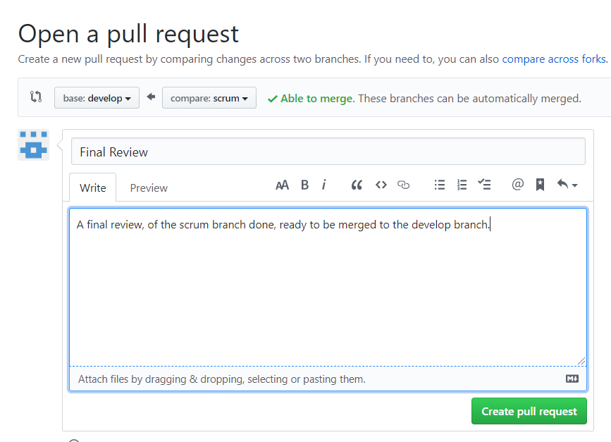
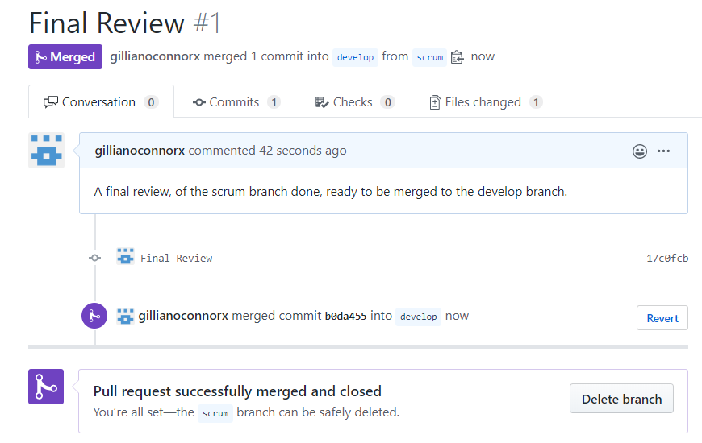

# Version Control

## Team Version Control
*Version control* is important for all code, files, and assets that multiple 
team members will collaborate on. I will be using this version control for my project.
Using version control software helps you keep track of changes.
	
I decided to split up my code using different branches.
	
**Master Branch**

The master branch will be the branch containing the finshed project. I will use pull requests 
to merge the other branches.
	
**Develop Branch**

This is where I will merge all my branches before using pull requests to merge it to the 
master branch.
	
**Scrum**

This will contain all my documentation for my sprint backlog.
	
**TDD**

This will contain all my documentation for my Test Driven Development.
	
**Coverage**

This will contain all my documentation for my test coverage metric used.
	
**CheckList**

This will contain all my documentation for my Code Review CheckList.
	
**Dev**

This branch will contain the code for the survey. 

**Devres**

This branch will contain the code for the survey responses. 

**Devmath**

This branch will contain the code for the maths ie. the average, the min and max score. 

	
* All the branches will be merged to the develop branch and then added to the master branch. 
* When the scrum sprint backlog was reviewed it was ready to be merged with the *develop branch*

1. A **pull request** was made to merge the srcum branch to the develop branch

2. The **pull request** was reviewed and approved, the branch was then merged, in team work the pull requests allow for members to 
review each others work.
The request was merged and closed.

	
	
	